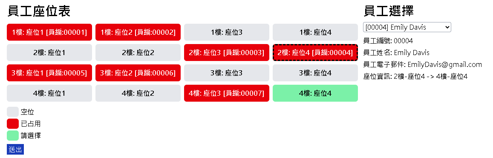

# 辦公室座位系統

此專案是一個基於網頁的應用程式，用於管理辦公室座位安排。它允許分配座位給員工、查看座位圖表，以及顯示員工資料。系統採用 **Vue 3** 前端和 **Spring Boot** 後端，並使用 MySQL 資料庫進行資料存儲。

## 功能

### 前端
- **座位圖顯示**：以視覺化方式展示辦公室座位，顯示已佔用和可用座位。
- **員工選擇**：提供下拉選單以選擇員工進行座位分配。
- **座位分配**：將選定的座位分配給員工，並驗證座位是否可用。

### 後端
- **RESTful API**：提供管理員工和座位的API Endpoints。
- **資料庫初始化**：啟動時自動建立資料表、程序和初始資料。
- **錯誤處理**：集中式異常處理，提供一致的API回應。
- **安全性**：使用 Spring Security防止SQL Injection以及XSS攻擊。

## API Endpoints

### 員工相關
- **取得所有員工**：`GET /api/employee/all`
- **分配座位**：`PUT /api/employee/{empId}/seat`

### 座位相關
- **取得所有座位**：`GET /api/seat/all`

---

## 編譯
### 需求
- JDK (版本 17 或以上)
- Maven (版本 ≈3.9 或以上)
- Node.js (版本 ≈16 或以上)

運行`build.sh`，將產生server.jar。

## 部屬
### 需求 (本機部署)
- MySQL
- Java 17

亦可使用docker compose進行部署

### 步驟
1. 編譯`server.jar`/[下載release](https://github.com/a2823kevin/Office-Seating-System---ESB-Practice/releases)
2. 設定.env內的環境變數為正確的參數
3. 於MySQL執行`DB/create_database.sql`，創建名為seating_system的資料庫。
4. 執行`run.sh`/`run.bat`，啟動系統。

## 使用
在系統運行的期間，預設可從 http://localhost:8080/ 進入系統操作介面。
